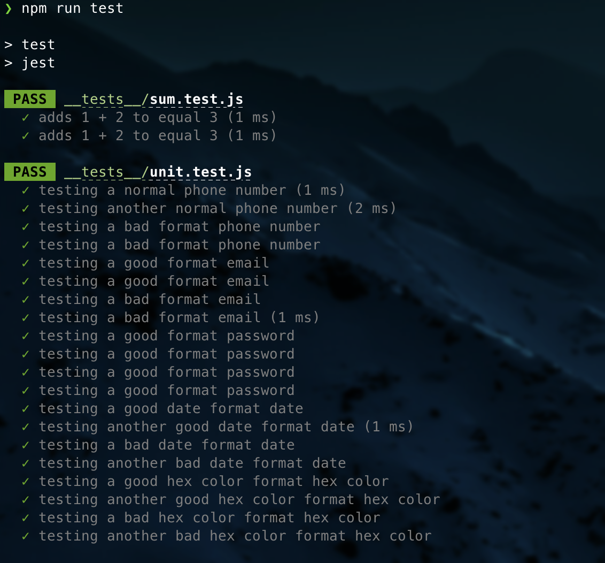
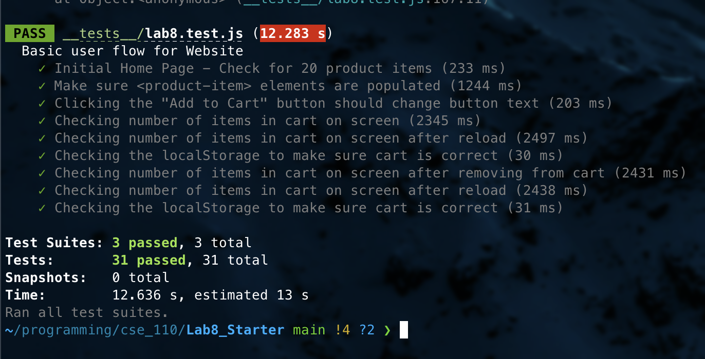

# Lab 8 - Starter

# Brandon Salinas Sanchez

# A16760692

1. Personally, I would fit my automated tests in a Github action that runs whenever the code is pushed. If the code fails some critical tests, then the push is flagged. My team has setup some github action that prevents a pr to be merged if some tests fail in order to ensure that the main branch is up to date and works.

2. No, becuase E2E tests are meant to test what a user would experience if they interacted with our website and not what is returned by some function.

3. I think it depends on what exactly you would want to use the unit test _to test_. For example, If I wanted to test whether or not the message sent over was correct (i.e. a string, specific value, etc), then I could test that in a unit test. But If I wanted to test whether or not the message was sent from me, and received by another user, then unit test would not be the way to go.

4. for testing a "max message length" feature then I would consider using unit testing. If a string is passed into the function, and the function returns a boolean where true is valid and false is too long, then it would be easy enough to create unit tests for this function.

## Screenshots of tests passing

